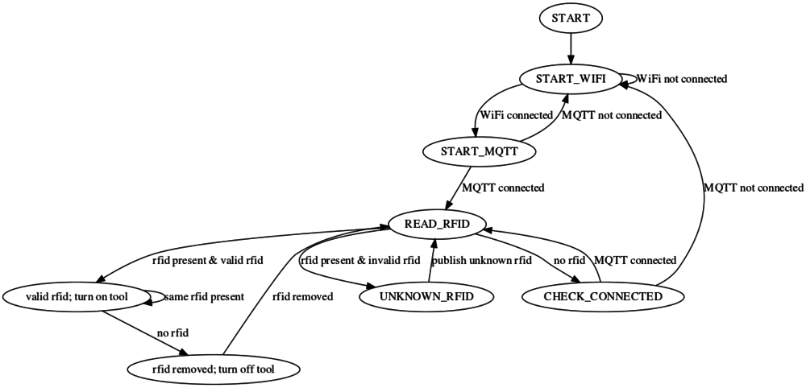

# ESP8266 based power controller

* Uses ESP8266 with SPI RFID reader to turn on/off power to machines
* Uses MQTT to validate RFIDs and log usage

# Software

* Mosquitto > v1.3 MQTT broker
* functioning [Arduino code](esp-rfid-mqtt)
* proof of concept [Python code](mqtt) to handle validating RFID and logging
